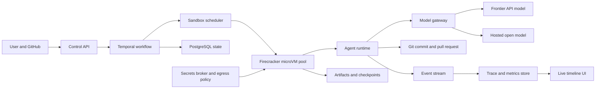
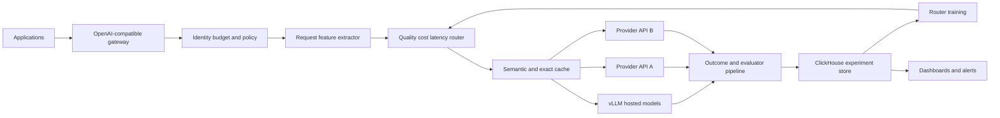
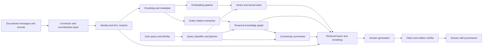
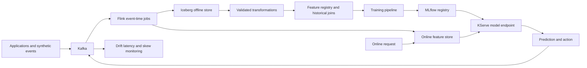
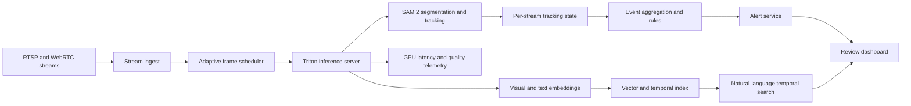

# Hardest, Highest-Impact AI-Engineer Resume Projects

## Executive recommendation

The strongest single resume project is a **durable, sandboxed coding-agent cloud**: a multi-tenant system that receives a GitHub issue, provisions an isolated execution environment, lets an agent inspect and modify the repository, survives infrastructure failures, runs tests, streams an auditable trace, and opens a pull request.

This project has unusually high hiring signal because it combines nearly every difficult layer of applied AI engineering:

- Agent behavior, tool use, context construction, memory, and evaluation.
- Distributed systems, durable execution, queues, autoscaling, and observability.
- Secure code execution, virtualization, secrets, and network isolation.
- Model-quality, latency, reliability, capacity, and cost tradeoffs.
- A user-facing product with objectively measurable outcomes.

These capabilities closely match current agent-infrastructure and applied-AI roles. OpenAI’s agent-infrastructure roles explicitly name sandboxing, virtualization, orchestration, stateful workflows, persistent memory, long-running tasks, model rollouts, reliability, latency, cost, FastAPI, gRPC, Terraform, Firecracker, gVisor, and Kubernetes-scale compute. Its applied-AI role additionally emphasizes solve-rate evaluation, context construction, tool strategies, production failure analysis, and feedback loops. citeturn13view0turn13view1turn13view2

The supplied project transcript reaches the same conclusion independently: the highest-signal topics are sandboxed cloud agents, durable execution through systems such as Temporal, context management, objective evaluations, observability, adaptive model routing, and repository-specific coding benchmarks. fileciteturn0file0

| Recommendation | Project | Why it ranks here | Main risk | Resume-quality completion criterion |
|---:|---|---|---|---|
| **Best overall** | Durable sandboxed coding-agent cloud | Maximum breadth and depth across AI, infrastructure, security, evaluation, and product engineering | Scope can expand indefinitely | Public system processing at least 50 reproducible tasks, with crash recovery, isolation tests, performance measurements, cost accounting, and a benchmarked solve rate |
| **Best signal-to-feasibility ratio** | Repository-specific coding-agent benchmark | Produces unusually credible, objective evidence of AI-engineering ability without requiring a large production platform | Creating valid, non-flaky tasks is harder than writing the harness | At least 100 reviewed tasks, multiple model and agent baselines, contamination analysis, confidence intervals, and a public leaderboard |
| **Best systems-and-model project** | Adaptive multi-model inference router | Demonstrates inference systems, evaluation, optimization, experimentation, and business-aware AI engineering | Requires trustworthy quality labels | At least 30% cost reduction at nearly unchanged quality, measured on a held-out workload with routing calibration and failover tests |
| Stronger product-oriented alternative | Permission-aware GraphRAG platform | Easier to demonstrate to non-infrastructure interviewers while retaining substantial retrieval, data, security, and evaluation depth | Can resemble an ordinary RAG demo without rigorous baselines | Hybrid and graph retrieval baselines, adversarial ACL testing, incremental indexing, provenance, and statistically reported retrieval improvements |

The most powerful portfolio strategy is to **combine the first three into one coherent flagship**:

> **Forge: a durable coding-agent cloud with a repository-specific evaluation suite and an adaptive model router.**

A credible first release would take approximately **fourteen focused weeks at twenty to twenty-five hours per week**. Adding the complete benchmark and learned router would extend it to roughly **eighteen to twenty-two weeks**. That is a large undertaking, but it produces a stronger narrative than three disconnected demos: you built an agent system, discovered its failures through evaluations, and improved its economics and solve rate through data-driven routing.

## Evaluation methodology and hiring signal

### What the scores measure

The comparison uses four independent dimensions:

| Dimension | Interpretation |
|---|---|
| **Difficulty** | Distributed-state complexity, model uncertainty, evaluation difficulty, security exposure, performance constraints, breadth of technologies, and debugging difficulty |
| **Time** | Estimated elapsed time for one experienced software engineer contributing approximately twenty to twenty-five focused hours per week |
| **Resume impact** | Relevance to current AI-engineering work, scarcity of demonstrated skills, objective demonstrability, architectural depth, and interview discussion potential |
| **Measurable completion** | Whether the project can produce reproducible numbers rather than only screenshots or anecdotal demos |

Scores are analytical estimates rather than market statistics. Projects received the highest impact scores when they demonstrate both **model-facing work** and **production systems work**. A technically impressive user interface around an API scores lower unless it also contains evaluations, failure handling, security boundaries, performance engineering, and measurable improvement.

OpenAI’s current agent roles describe precisely this intersection: execution environments, orchestration, persistent state, code-testing infrastructure, tokens, latency, reliability, cost, capacity, evaluations, context strategies, production logs, and feedback loops. OpenAI’s agent tooling similarly treats orchestration, handoffs, guardrails, tracing, and observability as core building blocks rather than optional additions. citeturn13view0turn13view1turn13view2turn14view0

Evaluation deserves disproportionate weight. SWE-bench converts real GitHub issues into reproducible software-engineering tasks, while Terminal-Bench couples task definitions with isolated terminal environments and deterministic grading. Anthropic’s engineering guidance notes that agent evaluations are unusually challenging because agents operate across multiple turns, use tools, alter environmental state, and may take many valid paths to completion. citeturn13view6turn13view7turn14view13

### Technical evidence behind the categories

The project candidates are grounded in production-grade systems and primary research:

- Agent projects draw from OpenAI’s Agents SDK, its evolving support for sandboxed and long-running agent execution, Temporal’s durable workflow model, Firecracker microVM isolation, and Google’s A2A interoperability effort. citeturn14view0turn13view3turn13view4turn13view5turn14view1
- Inference projects build on vLLM’s high-throughput serving engine, KServe’s Kubernetes-native model-serving control plane, Triton’s batching and multi-framework serving, and Ray’s distributed-compute primitives. citeturn13view8turn13view9turn3search0turn2search7
- Retrieval projects build on the original RAG formulation, FAISS vector search, ColBERT late interaction, and Microsoft GraphRAG. GraphRAG can improve corpus-level sensemaking, but its graph-extraction and summarization stage adds meaningful indexing cost, so a strong implementation must compare it against simpler retrieval. citeturn14view3turn14view4turn14view5turn13view10turn13view11turn5search14
- Production-data projects use Kafka, Flink, Iceberg, Feast, Kubeflow Pipelines, and MLflow. These systems cover event streaming, stateful stream processing, large analytic tables, point-in-time-correct features, reproducible pipelines, model management, and evaluation. citeturn14view8turn13view13turn14view9turn13view12turn14view6turn14view7
- Privacy, multimodal, interpretability, and AutoML projects are grounded in Flower, Opacus, SAM 2, CLIP, Captum, TransformerLens, and Optuna. citeturn13view15turn14view10turn13view14turn9search6turn14view11turn14view12turn13view16

## Comparative project portfolio

The complete sortable dataset, including full descriptions, core challenges, stacks, and measurable deliverables, is available here:

[Download the sortable project comparison CSV](sandbox:/mnt/data/ai_engineer_project_comparison_2026.csv)

The chart shows the central tradeoff: several projects cluster around impact scores of eight to nine, but only a small group reaches the top-right frontier where a project demonstrates model behavior, distributed execution, evaluation, and production reliability together.

| Rank | Project and concise description | Category | Core technical challenge and suggested stack | Difficulty | Solo weeks | Impact | Measurable finish |
|---:|---|---|---|---:|---:|---:|---|
| 1 | **Durable sandboxed coding-agent cloud.** Convert GitHub issues into tested pull requests inside isolated, resumable environments. | Cloud agents | Isolation, durable workflows, context compaction, secrets, autoscaling. Python/TypeScript, Temporal, Firecracker or gVisor, Kubernetes, PostgreSQL, OpenTelemetry | 10.0 | 14 | 10.0 | 50–100 tasks; scoped solve rate; forced-crash recovery; p95 sandbox startup; cost dashboard; threat model |
| 2 | **Repository-specific coding-agent benchmark.** Build a SWE-bench-style dataset and execution harness for real repositories. | Benchmarking / research OSS | Non-leaky task mining, historical environments, deterministic grading, contamination analysis. Python, Docker, pytest, GitHub API, Parquet, Hugging Face Datasets | 9.5 | 10 | 9.8 | 100+ validated tasks; under 2% flaky rate; six baselines; confidence intervals; public leaderboard |
| 3 | **Adaptive multi-model inference gateway.** Route each request to the cheapest model likely to meet its quality target. | Models / infrastructure | Calibrated routing, online feedback, provider failover, budget policy, tail latency. Python/Rust, Envoy, vLLM, Redis, Kafka, ClickHouse, Optuna | 9.5 | 12 | 9.8 | At least 30% cost reduction at no more than 1% quality loss; under 30 ms p95 gateway overhead |
| 4 | **Multi-tenant LLM serving platform.** Operate open models with batching, caching, quotas, autoscaling, and canaries. | Production ML infrastructure | GPU utilization, memory pressure, model loading, tenancy, SLOs. vLLM, KServe, Triton, Ray, Kubernetes, Prometheus | 9.0 | 11 | 9.6 | 100+ concurrent users; throughput curves; at least 70% GPU utilization; zero-downtime rollout; chaos report |
| 5 | **Agent observability and evaluation control plane.** Capture traces, tool calls, costs, outcomes, feedback, and regressions. | Agents / MLOps | Trace schemas, replay, redaction, evaluator reliability, experiment statistics. OpenTelemetry, Kafka, ClickHouse, MLflow, React | 8.5 | 10 | 9.4 | One million synthetic spans per day; trace replay; confidence intervals; cost and solve-rate alerts |
| 6 | **Permission-aware GraphRAG knowledge platform.** Combine hybrid retrieval, graphs, provenance, temporal updates, and ACLs. | Knowledge systems / RAG | Entity resolution, graph costs, incremental indexing, access control, global query planning. GraphRAG, Neo4j, OpenSearch, FAISS/ColBERT | 9.0 | 12 | 9.4 | 10,000–100,000 documents; at least 15% nDCG uplift; zero ACL leaks; groundedness and freshness reports |
| 7 | **Real-time feature platform and online inference system.** Build an event-time fraud or recommendation stack. | Data pipelines / production ML | Exactly-once behavior, late events, online/offline parity, backfills, p99 latency. Kafka, Flink, Iceberg, Feast, Redis, MLflow, KServe | 9.0 | 12 | 9.4 | 10,000 events/s; under 20 ms p99 feature lookup; under 75 ms inference; below 0.1% feature mismatch |
| 8 | **Self-service MLOps platform.** Turn a repository into tested pipelines, models, deployments, monitoring, and rollback. | Production ML infrastructure | Reproducibility, lineage, metadata, policy gates, team ergonomics. Kubeflow Pipelines, MLflow, KServe, Feast, Argo CD | 9.0 | 13 | 9.3 | One-command deployment; reproducible retraining; signed artifacts; canary rollback; lineage graph |
| 9 | **Real-time multimodal video intelligence.** Detect, segment, track, embed, search, and alert across live streams. | Multimodal / real-time | Frame scheduling, GPU memory, persistent tracking, temporal search, false alarms. SAM 2, CLIP, Triton, Kafka, RTSP/WebRTC, FAISS | 9.0 | 12 | 9.2 | Four to eight 1080p streams; under 1 second p95 alerts; tracking/segmentation metrics; cost curves |
| 10 | **Long-horizon research agent with durable memory.** Execute multi-hour research with provenance, checkpoints, and context compaction. | Cloud agents | Long-context degradation, memory selection, browser failures, plan repair, citation checking. Temporal, PostgreSQL/pgvector, browser automation | 8.5 | 10 | 9.1 | 50 research tasks; citation precision and recall; crash recovery; measured token savings; preference study |
| 11 | **Multi-agent SRE incident commander.** Let specialist agents investigate telemetry and propose gated remediations. | Multi-agent systems | Shared state, conflicting hypotheses, safe actions, approval gates, replay. Temporal, Prometheus, Loki, Kubernetes, policy engine | 9.0 | 12 | 9.1 | 20 injected incidents; MTTR comparison; zero unauthorized actions; complete audit and replay |
| 12 | **Enterprise hybrid RAG platform.** Support connectors, dense/sparse retrieval, late interaction, reranking, ACLs, and evaluation. | RAG platforms | Chunking, retrieval fusion, freshness, permission filters, reranking latency. OpenSearch, FAISS, ColBERT, PostgreSQL | 8.5 | 10 | 9.0 | Five connectors; 100,000 documents; Recall@k/nDCG; groundedness; under 2-second p95 responses |
| 13 | **Major contribution to a production AI OSS project.** Own a substantial feature or optimization in vLLM, KServe, Feast, Flower, or TransformerLens. | Research-grade OSS | Mature codebase comprehension, compatibility, profiling, review standards, distributed debugging | 9.0 | 14 | 9.0 | Merged RFC and pull request; major feature or at least 10% performance improvement; tests and public write-up |
| 14 | **Multimodal semantic search engine.** Search images, clips, audio, and text through a shared retrieval interface. | Multimodal systems | Cross-modal alignment, temporal segmentation, hard negatives, large indexes. CLIP/SigLIP, ASR, FAISS, OpenSearch | 8.0 | 9 | 8.9 | One million embeddings; cross-modal Recall@k; under 250 ms p95 search; relevance-feedback uplift |
| 15 | **Agent-native collaborative workspace.** A Slack-like product where humans and interoperable agents exchange tasks and artifacts. | Multi-agent systems | Identity, capability discovery, interoperability, permissions, runaway loops. A2A-compatible protocol, TypeScript/Rust, NATS, PostgreSQL | 8.5 | 10 | 8.8 | Three interoperable agents; twenty workflows; bounded loops; conformance tests; full audit trail |
| 16 | **Lakehouse CDC and streaming ETL platform.** Move operational changes into an Iceberg lakehouse with schema evolution and backfills. | Data pipelines / ETL | Ordering, idempotency, small files, exactly-once sinks, recovery. Debezium, Kafka, Flink, Iceberg, dbt, Trino | 8.5 | 11 | 8.8 | 50,000 events/s; zero-loss failover; schema migration; freshness SLA; cost-per-terabyte benchmark |
| 17 | **LLM and ML robustness red-team platform.** Test jailbreaks, retrieval poisoning, adversarial prompts, and distribution shift. | Robustness | Realistic threat models, adaptive attacks, evaluator bias, severity scoring. Python, evaluation harnesses, MLflow, Kubernetes | 8.5 | 10 | 8.7 | 500 attacks; attack-success dashboard; poisoned-RAG benchmark; mitigation ablations; CI regression gates |
| 18 | **Federated learning platform with differential privacy.** Train across heterogeneous simulated clients with privacy accounting. | Privacy-preserving ML | Non-IID data, stragglers, dropout, communication, poisoning, privacy/utility tradeoff. Flower, PyTorch, Opacus, Ray | 9.0 | 12 | 8.7 | 100–1,000 clients; epsilon/accuracy curves; poisoning and dropout tests; centralized baseline |
| 19 | **Distributed AutoML and NAS scheduler.** Optimize quality, latency, memory, and cost across asynchronous workers. | AutoML / NAS | Search spaces, noisy objectives, early-stop bias, Pareto optimization, scheduling. Optuna, Ray, Katib, Kubernetes, MLflow | 9.0 | 12 | 8.6 | 500 trials; at least 3× pruning speedup; Pareto frontier; deployment-aware constraints; ablations |
| 20 | **Temporal knowledge graph and agent-memory substrate.** Store provenance-aware facts and relationships that change over time. | Knowledge systems | Entity resolution, temporal validity, contradictions, forgetting, privacy deletion. Neo4j/Memgraph, PostgreSQL, Kafka, embeddings | 8.5 | 10 | 8.6 | 10,000 events; temporal-query accuracy; contradiction handling; deletion tests; memory precision/recall |
| 21 | **Multilingual permission-aware RAG.** Retrieve across mixed-language and code-switched corpora without leaking restricted documents. | RAG platforms | Low-resource retrieval, translation drift, code-switching, ACL filtering. Multilingual E5/BGE, OpenSearch/FAISS, reranker | 8.0 | 9 | 8.5 | Five languages; per-language Recall@k; code-switch benchmark; zero ACL leaks; human evaluation |
| 22 | **RAG evaluation and regression laboratory.** Compare chunkers, embeddings, indexes, rerankers, and generators reproducibly. | Benchmarking | Label quality, evaluator agreement, significance testing, latency-quality-cost tradeoffs. MLflow, Optuna, FAISS, ColBERT | 7.5 | 8 | 8.5 | 1,000 judged queries; bootstrap confidence intervals; cost-quality frontier; automated regression gate |
| 23 | **Point-in-time-correct feature store.** Implement historical joins, materialization, freshness, and online/offline parity. | Production ML infrastructure | Temporal joins, backfills, schema changes, skew, API design. Flink/Spark, Iceberg, Redis, PostgreSQL, dbt | 8.0 | 9 | 8.4 | Point-in-time correctness suite; below 0.1% skew; under 20 ms p99 fetch; lineage interface |
| 24 | **AI data quality, contracts, and lineage platform.** Detect drift and leakage and block unsafe training or deployment. | Data / MLOps | Scalable profiling, false alerts, lineage capture, ownership, policy enforcement. Great Expectations, OpenLineage, dbt, Iceberg, MLflow | 8.0 | 9 | 8.3 | 100 checks; incident corpus; detection precision/recall; lineage graph; deployment gate |
| 25 | **Streaming meeting-intelligence system.** Combine live transcription, diarization, screen context, action extraction, and searchable memory. | Multimodal systems | Streaming ASR, diarization, alignment, action precision, correction. WebRTC, Kafka, ASR, vector search, PostgreSQL | 8.0 | 9 | 8.2 | WER and DER; under 2-second partial transcripts; action-item F1; twenty-meeting test set |
| 26 | **Differentially private fine-tuning service.** Train small language or vision models with reported privacy budgets. | Privacy-preserving ML | Per-sample gradients, clipping, noise, accounting, memory, membership leakage. PyTorch, Opacus, Ray, MLflow | 8.5 | 10 | 8.2 | Epsilon/delta reporting; utility curves; membership-inference audit; throughput and memory benchmark |
| 27 | **Mechanistic interpretability workbench.** Run activation, attribution, probing, and causal-intervention experiments. | Interpretability | Causal validity, activation storage, confounding, scalable sweeps. TransformerLens, Captum, PyTorch, Ray | 8.5 | 10 | 8.1 | Reproduce a published result; causal ablations; negative controls; activation dataset; research report |

## Portfolio analysis

### Highest hiring-signal frontier

The top projects fall into three distinct hiring-signal patterns.

**The systems-heavy frontier** consists of the coding-agent cloud, model-serving platform, inference router, streaming feature platform, and MLOps platform. These prove that the candidate can make AI functionality reliable under concurrency, failures, capacity limits, and cost constraints. vLLM exposes optimizations such as continuous batching, prefix caching, quantization, speculative decoding, and distributed parallelism; KServe and Triton add deployment, autoscaling, batching, protocol, and observability concerns. A project that measures these mechanisms is much stronger than merely deploying a model endpoint. citeturn13view8turn13view9turn3search0

**The evaluation-heavy frontier** consists of the repository benchmark, agent-observability control plane, RAG evaluation laboratory, and robustness platform. These projects signal scientific discipline: dataset construction, deterministic execution, controlled baselines, error taxonomies, confidence intervals, and regression gates. Because current applied-AI work explicitly emphasizes measurable solve-rate gains and production feedback loops, evaluation infrastructure can outperform more visually impressive but unmeasured products in technical interviews. citeturn13view2turn13view6turn13view7turn14view13

**The product-plus-research frontier** includes GraphRAG, real-time video intelligence, long-horizon research agents, multimodal search, and federated learning. These projects contain substantial model behavior while still producing a compelling demonstration. The danger is stopping at a demo: the project must include retrieval or perception metrics, baseline comparisons, failure slices, latency measurements, and operational behavior.

### Best projects by candidate profile

| Existing strength | Best flagship | Why |
|---|---|---|
| Backend or distributed systems | Durable coding-agent cloud | Converts existing systems skill into agent infrastructure, model integration, and evaluation evidence |
| ML modeling or research | Repository benchmark or robustness platform | Adds reproducibility, systems engineering, and production feedback loops |
| Data engineering | Real-time feature and inference platform | Connects event processing and lakehouse knowledge to online ML behavior |
| Full-stack engineering | Permission-aware GraphRAG or agent workspace | Produces a polished product while forcing work on retrieval quality, access control, state, and observability |
| DevOps or platform engineering | Multi-tenant LLM serving platform | Demonstrates GPU scheduling, autoscaling, rollout, SLO, and cost engineering |
| Computer vision | Real-time video intelligence | Extends model work into stream processing, GPU serving, temporal state, and product evaluation |

### Projects to avoid as standalone resume centerpieces

A generic chatbot, thin model-API wrapper, PDF question-answering application, prompt collection, basic fine-tuning notebook, or agent built entirely from framework defaults is not sufficiently differentiating. The issue is not the product category; it is the absence of difficult evidence. A RAG system becomes strong when it adds access-control guarantees, retrieval baselines, incremental indexing, adversarial evaluation, provenance, and latency targets. An agent becomes strong when it adds durable execution, isolation, evaluation, trace replay, recovery, and cost controls.

Similarly, “multi-agent” does not automatically imply sophistication. Multiple agents can add latency, token consumption, coordination failures, and nondeterminism without improving outcomes. OpenAI’s SDK supports handoffs, guardrails, and tracing, while Google’s A2A work addresses interoperability; neither removes the need to prove that additional agents outperform a simpler single-agent baseline. citeturn14view0turn14view1

## Detailed implementation blueprints

**Durable sandboxed coding-agent cloud**

**Target outcome.** A user installs a GitHub App, selects an issue, and launches a task. The control plane starts a clean microVM, checks out the repository, runs setup commands, lets the agent inspect and edit files, executes tests under policy controls, checkpoints every meaningful transition, and opens a pull request. The browser displays live events, test outputs, token usage, cost, and the final patch.

Firecracker is designed around lightweight KVM microVMs with a deliberately reduced device model and attack surface. Temporal persists workflow progress and reconstructs execution after worker failures, making it a strong fit for multi-hour agent runs. These technologies address two concerns central to current agent-infrastructure roles: safe code execution and resumable stateful workflows. citeturn13view4turn13view5turn13view0turn13view1

**Minimum viable deliverable.** One repository template, one agent implementation, Docker-based isolation initially, issue-to-pull-request execution, durable checkpointing at every model and tool turn, live logs, and a twenty-five-task evaluation. Firecracker can replace Docker after the workflow and evaluator are stable.

| Milestone | Scope |
|---|---|
| Weeks one and two | Define event schema, task state machine, GitHub App, repository checkout, agent loop, and deterministic local runner |
| Weeks three and four | Add Temporal workflows, idempotent activities, retries, cancellation, checkpoint recovery, and artifact storage |
| Weeks five and six | Build sandbox lifecycle service, resource limits, filesystem snapshots, network egress policy, and short-lived credential injection |
| Weeks seven and eight | Add streaming timeline, token and cost accounting, context compaction, repository search, and test-result summarization |
| Weeks nine and ten | Construct fifty tasks, graders, baseline agents, failure taxonomy, and per-task trace replay |
| Weeks eleven and twelve | Add multi-tenancy, quotas, autoscaling, scheduling fairness, security tests, and chaos experiments |
| Weeks thirteen and fourteen | Optimize startup and task latency, publish architecture and threat-model documents, record demo, and release benchmark results |

**Recommended stack.** Python for the agent and evaluation harness; Go or Rust for the sandbox scheduler; Temporal; Firecracker or gVisor; Kubernetes; PostgreSQL; S3-compatible artifact storage; NATS or Kafka; OpenTelemetry; ClickHouse; React; GitHub Apps; Terraform. OpenAI’s current infrastructure role explicitly lists FastAPI, gRPC, Terraform, Kubernetes-scale orchestration, and virtualization technologies such as Firecracker and gVisor. citeturn13view0

**Cloud and cost.** Start with a single KVM-capable host and managed PostgreSQL rather than a large cluster. A moderate prototype is likely to cost approximately **$300–$1,000 per month**, dominated by model tokens and always-on compute. A concurrency demonstration with many simultaneous sandboxes can reach **$1,000–$3,000 per month**. These are workload estimates; actual cost depends strongly on task length and model choice. Current official model pricing is token-based, while cloud accelerator pricing is hourly and region-dependent. citeturn14view14turn13view17

**Testing and validation.** Use deterministic unit tests for state transitions and tool policies; integration tests against fixture repositories; forced worker, database-connection, and sandbox crashes; repeated-run flakiness analysis; prompt-injection and secret-exfiltration tests; filesystem and network escape tests; resource-exhaustion tests; and benchmark comparisons using identical model settings. Report solve rate with bootstrap confidence intervals, median and p95 completion time, tokens per solved task, dollars per solved task, sandbox-start latency, recovery time, and failure distribution.

**Interview talking points.** Explain why the agent loop and workflow engine are separate; how activities remain idempotent; where checkpoints occur; how credentials avoid entering model context; how outbound networking is restricted; how context is compacted without losing unresolved constraints; why retries can duplicate side effects; how the scheduler handles noisy neighbors; and how evaluation findings changed the architecture.

**Repository-specific coding-agent benchmark and RL environment**

**Target outcome.** Produce a public benchmark for one substantial open-source repository or a coherent group of repositories. Each task contains a historical codebase state, issue statement, reproducible environment, hidden grader, expected behavior, metadata, and difficulty classification. Agents run in isolated sandboxes, and a leaderboard reports solve rate, cost, latency, and reliability.

SWE-bench established the basic pattern of evaluating models against real GitHub issues in reproducible environments. Terminal-Bench separates task definitions, execution environments, harnesses, and graders for terminal-based agents. A repository-specific implementation is valuable precisely because reliable task construction and environment reconstruction are difficult. citeturn13view6turn13view7

```mermaid
flowchart LR
    GH[Issues and pull requests] --> MINER[Issue miner]
    MINER --> CAND[Candidate tasks]
    CAND --> REVIEW[Automated and human validation]
    REVIEW --> SPEC[Task specifications]
    SPEC --> BUILD[Environment image builder]
    BUILD --> REG[Image registry]
    SPEC --> DATA[Versioned dataset]
    DATA --> HAR[Evaluation harness]
    REG --> HAR
    HAR --> A1[Agent adapter]
    HAR --> A2[Model adapter]
    A1 --> BOX[Isolated task sandbox]
    A2 --> BOX
    BOX --> GR[Hidden grader]
    GR --> RES[Results and traces]
    RES --> LB[Leaderboard and analysis]
```

**Minimum viable deliverable.** Thirty manually reviewed tasks from one repository, reproducible container images, one direct-model baseline, two agent baselines, deterministic pass/fail graders, and a static results report.

| Milestone | Scope |
|---|---|
| Week one | Select repository, define task acceptance criteria, licensing policy, contamination policy, and benchmark schema |
| Weeks two and three | Mine issues and merged pull requests; reconstruct base commits; derive candidate tests and patches |
| Weeks four and five | Build images, setup scripts, hidden graders, network policy, timeouts, and resource limits |
| Week six | Run repeated validation, eliminate flaky tasks, classify task types, and perform manual quality review |
| Weeks seven and eight | Implement model and agent adapters, distributed execution, trace collection, cost accounting, and resumability |
| Week nine | Run baselines and ablations; compute confidence intervals; analyze leakage and failure categories |
| Week ten | Publish dataset card, benchmark paper, leaderboard, reproducibility instructions, and a sample upstream contribution |

**Recommended stack.** Python, Docker or Firecracker, pytest, GitHub GraphQL API, Parquet, Hugging Face Datasets, Kubernetes or an ephemeral-compute service, PostgreSQL, MLflow or Weights & Biases, and object storage.

**Cloud and cost.** Environment construction is mainly CPU-intensive. A thirty-task development benchmark can remain below **$100–$300**, while repeated sweeps over one hundred tasks and several premium models may cost **$300–$1,500 per major experiment**. Store all model outputs and rerun graders independently so failed infrastructure does not require another model call.

**Testing and validation.** Require multiple consecutive clean executions before accepting a task. Reject tasks that pass before the agent changes anything, depend on external services, expose the reference patch, produce inconsistent results, or cannot be understood from the issue and repository. Maintain separate public development and hidden test splits. Report task-level paired comparisons and confidence intervals instead of only aggregate percentages.

**Interview talking points.** Discuss benchmark leakage, ecological validity, flaky tests, whether tests fully represent the issue, how historical dependencies are reconstructed, why pass/fail is insufficient for partial progress, and how a benchmark can incentivize overfitting. A particularly strong answer explains how benchmark failures were distinguished from agent failures.

**Adaptive multi-model inference gateway and router**

**Target outcome.** Provide an OpenAI-compatible endpoint that classifies incoming requests, estimates the probability that each model will satisfy the quality target, and chooses the cheapest acceptable option. The gateway must enforce team budgets, redact sensitive data, cache safe requests, fail over between providers, support self-hosted models, and record outcome feedback.

**Minimum viable deliverable.** Three model endpoints, a rules baseline, a learned binary “small model sufficient” classifier, per-user budgets, failover, request logging, and an offline evaluation on at least one thousand labeled requests.

| Milestone | Scope |
|---|---|
| Weeks one and two | Define quality, cost, and latency objectives; implement provider-neutral request and response schemas |
| Weeks three and four | Build gateway, authentication, rate limits, retries, circuit breakers, tracing, and streaming responses |
| Weeks five and six | Assemble workload and labels; extract prompt, domain, token, uncertainty, and tool-use features |
| Weeks seven and eight | Train routing baselines; calibrate probabilities; build offline replay and Pareto-frontier analysis |
| Weeks nine and ten | Add vLLM endpoint, caching, budget enforcement, privacy policies, and automatic failover |
| Week eleven | Add shadow traffic, canaries, online feedback, drift alerts, and rollback |
| Week twelve | Load-test the gateway and publish quality-cost-latency results with ablations |

**Recommended stack.** Rust or Python, FastAPI or gRPC, Envoy, Redis, Kafka, ClickHouse, vLLM, Kubernetes, OpenTelemetry, Prometheus, Optuna, and a small gradient-boosting or transformer classifier. vLLM is particularly useful because it exposes batching, prefix caching, quantization, speculative decoding, and distributed serving through an OpenAI-compatible interface. citeturn13view8

**Cloud and cost.** A continuously allocated L4-class GPU is approximately **$409 per month for GPU time alone** at Google Cloud’s listed rate of about $0.56004 per hour, before VM, disk, networking, and regional adjustments. A realistic mixed API and self-hosted prototype therefore falls around **$500–$1,500 per month**, although intermittent GPU operation can reduce this substantially. citeturn13view17

**Testing and validation.** Compare random routing, cheapest-model routing, largest-model routing, rule-based routing, and learned routing. Use a held-out temporal split to prevent closely related prompts leaking into training. Measure task quality, expected calibration error, cost per accepted response, p50/p95 latency, provider error rate, cache hit rate, and regret relative to an oracle router. Test provider outages, streaming interruption, retry storms, malformed responses, and budget exhaustion.

**Interview talking points.** Explain why model identity is a treatment rather than merely a label; how selection bias enters feedback data; why LLM judges cannot be the only quality signal; how calibrated probabilities become routing thresholds; how a router handles unfamiliar domains; and when a more expensive model is selected for safety rather than raw task complexity.

**Permission-aware GraphRAG knowledge platform**

**Target outcome.** Ingest internal documents, messages, tickets, and structured records; preserve document-level permissions; build dense, sparse, and graph indexes; route local factual questions and global synthesis questions differently; and produce citation-backed answers without exposing unauthorized content.

The original RAG work combines parametric generation with retrieved external knowledge. FAISS provides scalable dense-vector search, ColBERT uses late interaction to preserve token-level matching, and GraphRAG adds graph extraction and community summaries for corpus-level sensemaking. GraphRAG’s additional indexing work should be justified empirically rather than assumed to improve every query. citeturn14view3turn14view4turn14view5turn13view10turn13view11

**Minimum viable deliverable.** Ten thousand documents, two source connectors, user/group permissions, dense-plus-BM25 retrieval, a graph index, local/global query routing, citations, and a two-hundred-question evaluation set.

| Milestone | Scope |
|---|---|
| Weeks one and two | Define document, identity, ACL, provenance, and deletion models; implement connectors |
| Weeks three and four | Build chunking, lexical retrieval, dense retrieval, metadata filters, and ingestion observability |
| Weeks five and six | Add graph extraction, entity resolution, community detection, summaries, and incremental updates |
| Weeks seven and eight | Build query planner, fusion, reranker, citation generation, and answer verification |
| Weeks nine and ten | Construct judged queries, global and local subsets, permission attacks, and baseline experiments |
| Weeks eleven and twelve | Optimize cost and latency, test deletion and freshness, publish ablations and architecture report |

**Recommended stack.** Microsoft GraphRAG, Neo4j or Memgraph, OpenSearch, FAISS or ColBERT, PostgreSQL, object storage, Dagster or Airflow, FastAPI, React, OpenTelemetry, and an identity provider using OAuth/OIDC.

**Cloud and cost.** A small, intermittently indexed corpus can be developed for **$100–$500 per month**. Repeated graph extraction over large corpora can raise model costs considerably, so cache extraction outputs, make indexing incremental, and include a graph-build cost per document in the report. Microsoft’s own GraphRAG material cautions that benefits must be weighed against upfront indexing cost. citeturn5search14turn14view14

**Testing and validation.** Measure Recall@k, nDCG, mean reciprocal rank, answer correctness, claim-level citation precision, unsupported-claim rate, latency, and dollars per query. Compare BM25, dense retrieval, hybrid retrieval, late-interaction retrieval, and GraphRAG. Add adversarial tests in which a relevant but unauthorized document ranks above an authorized result. Verify group membership changes, deletion, stale indexes, malicious document instructions, and contradictory sources.

**Interview talking points.** Explain pre-filtering versus post-filtering ACLs; why unauthorized chunks must not enter the model context; how entity resolution errors propagate; when graph summaries help; how incremental graph updates avoid full re-indexing; and which query classes did not benefit from GraphRAG.

**Real-time feature platform and online inference system**

**Target outcome.** Simulate or ingest user and transaction events, compute event-time features, maintain point-in-time-correct historical data, materialize low-latency online features, train models reproducibly, deploy them through canaries, and monitor drift and online/offline skew.

Flink is designed for stateful stream processing with event-time semantics and exactly-once state consistency. Feast separates historical feature retrieval from low-latency online serving and emphasizes point-in-time-correct training data. Kafka and Iceberg provide the event log and durable analytic-table layers. citeturn13view13turn13view12turn14view8turn14view9

**Minimum viable deliverable.** A synthetic fraud or recommendation workload, Kafka event ingestion, two Flink feature pipelines, Iceberg historical storage, Feast definitions, Redis online serving, one trained model, and a low-latency prediction API.

| Milestone | Scope |
|---|---|
| Weeks one and two | Define events, data contracts, synthetic generator, Kafka topics, schemas, and replay strategy |
| Weeks three and four | Implement event-time features, windows, watermarks, deduplication, late-data policy, and checkpoints |
| Weeks five and six | Add Iceberg tables, transformations, quality checks, feature registry, and point-in-time joins |
| Weeks seven and eight | Train reproducibly, register models, deploy online endpoint, and implement shadow and canary modes |
| Weeks nine and ten | Add drift, skew, freshness, latency, and business-outcome monitoring; implement rollback |
| Weeks eleven and twelve | Run load, failure, replay, and backfill tests; publish cost, correctness, and performance results |

**Recommended stack.** Kafka, Flink, Iceberg, Feast, Redis or ScyllaDB, dbt, Great Expectations, MLflow, KServe, Kubernetes, Prometheus, Grafana, and OpenTelemetry. Kubeflow Pipelines or Dagster can orchestrate retraining and backfills. citeturn14view6turn14view7turn6search5

**Cloud and cost.** A compact three-node local or cloud cluster can be demonstrated for approximately **$150–$600 per month**. Use spot capacity, scale workers down outside experiments, and generate reproducible workloads rather than paying for continuous high-volume external traffic.

**Testing and validation.** Test out-of-order events, duplicate messages, late arrivals, schema evolution, checkpoint recovery, consumer restarts, poison records, hot keys, offline backfills, and online-store outages. Verify point-in-time correctness with deliberately leaked future values. Report feature freshness, online/offline mismatch, p50/p95/p99 lookup and inference latency, throughput, recovery point, recovery time, drift-detection delay, and model rollback time.

**Interview talking points.** Explain event time versus processing time; why exactly-once state does not automatically make every external side effect exactly once; how watermarks trade completeness for latency; how training-serving skew arises; why point-in-time joins prevent leakage; and how shadow predictions differ from canaries.

**Real-time multimodal video-intelligence pipeline**

**Target outcome.** Accept live RTSP or WebRTC streams, schedule frames intelligently, segment and track prompted objects, create semantic embeddings for clips and events, support natural-language temporal search, and produce low-latency alerts.

SAM 2 extends promptable segmentation to images and video and uses streaming memory for real-time video processing. CLIP provides aligned image-text representations that can support semantic retrieval. Combining them forces work on perception, stateful streaming, GPU-serving efficiency, event indexing, and product evaluation. citeturn13view14turn9search6

**Minimum viable deliverable.** Two simultaneous streams, object prompting, persistent tracking, event clips, text-to-clip search, a review interface, and one labeled evaluation dataset.

| Milestone | Scope |
|---|---|
| Weeks one and two | Build stream ingestion, recording, timestamps, buffering, reconnect behavior, and reproducible video fixtures |
| Weeks three and four | Integrate segmentation and tracking; manage per-stream state and prompt updates |
| Weeks five and six | Add adaptive frame sampling, batching, Triton serving, GPU telemetry, and backpressure |
| Weeks seven and eight | Generate embeddings, temporal segments, vector index, semantic search, and event clips |
| Weeks nine and ten | Add alert rules, confidence calibration, review UI, privacy controls, and retention policy |
| Weeks eleven and twelve | Label evaluation data; run quality, latency, concurrency, failure, and cost experiments |

**Recommended stack.** SAM 2, CLIP or SigLIP, PyTorch, Triton, Kafka, FFmpeg or GStreamer, RTSP/WebRTC, FAISS, PostgreSQL, object storage, FastAPI, React, Kubernetes, and OpenTelemetry. Triton’s dynamic and sequence batching are particularly relevant where inputs arrive continuously but each stream also carries state. citeturn3search0

**Cloud and cost.** One continuously running L4-class GPU costs roughly **$409 per month for GPU allocation alone** at the referenced list price. Including the host, storage, and intermittent additional workers, a practical prototype is approximately **$450–$1,500 per month**. Running the GPU only during development and demonstrations reduces cost significantly. citeturn13view17

**Testing and validation.** Use frozen videos for repeatable quality tests and live feeds for operational tests. Report segmentation J&F or mIoU, detection precision and recall, tracking MOTA/HOTA or identity-switch counts, temporal-search Recall@k, alert precision, frame throughput, end-to-end p95 latency, stream-reconnect recovery, dropped-frame rate, and GPU utilization. Test camera loss, timestamp disorder, slow consumers, burst traffic, malformed streams, and out-of-memory recovery.

**Interview talking points.** Explain why every frame should not necessarily be processed; how batching affects alert latency; where temporal state resides; how tracker drift is detected; how search windows are generated; how false alerts are calibrated; and how privacy retention differs between embeddings, metadata, and raw video.

## Execution strategy and source map

### Recommended build sequence

For the flagship coding-agent project, do not begin with Kubernetes or a polished interface. The highest-probability sequence is:

| Phase | Deliverable | Exit condition |
|---|---|---|
| Behavioral core | Local agent solving fixture issues | All model/tool interactions are recorded and replayable |
| Evaluation first | Twenty-five to fifty deterministic tasks | Every change can be compared against a fixed baseline |
| Durability | Workflow recovery and idempotent activities | Forced process termination resumes without repeating destructive actions |
| Isolation | Restricted disposable execution environment | Secret, filesystem, resource, and network tests pass |
| Product layer | GitHub integration and live trace interface | External users can understand what happened without reading raw logs |
| Scale and economics | Queueing, quotas, autoscaling, routing, cost analysis | Published latency, throughput, solve-rate, and cost-per-solved-task results |
| Public proof | Repository, demo, technical report, benchmark data | Another engineer can reproduce the principal result from documentation |

The project should be presented as an engineering investigation rather than a feature checklist. A strong final report states a hypothesis, defines baselines, describes architecture decisions, reports failed approaches, quantifies tradeoffs, and identifies remaining limitations.

### Resume packaging

The repository should contain an architecture decision record, threat model, benchmark card, evaluation methodology, reproducible deployment, load-test scripts, dashboards, representative traces, failure taxonomy, cost model, and a concise demonstration video.

A strong resume entry would read:

> **Built a multi-tenant coding-agent cloud using Temporal, Firecracker, Kubernetes, and OpenTelemetry; executed 100 reproducible repository tasks with durable crash recovery and isolated code execution, achieved a measured X% solve rate, reduced cost per solved task by Y% through adaptive model routing, and maintained p95 sandbox startup below Z seconds.**

The placeholders must be replaced with real measurements. The strongest interview artifact is not the demo itself, but the evidence showing how evaluation and production failures led to concrete system improvements.

### Primary sources and implementation references

**Agent systems and hiring requirements:** OpenAI Agent Infrastructure role; OpenAI Codex Core Agents role; OpenAI Applied AI Engineer role; OpenAI Agents SDK and Responses API; Google A2A. citeturn13view0turn13view1turn13view2turn14view0turn14view1

**Durable and isolated execution:** Temporal durable execution; Firecracker microVM repository; OpenAI’s evolution of sandboxed agent execution. citeturn13view4turn13view5turn13view3

**Evaluation:** SWE-bench; Terminal-Bench; OpenAI Evals; Anthropic’s agent-evaluation engineering guide. citeturn13view6turn13view7turn1search0turn14view13

**Inference and orchestration:** vLLM; KServe; NVIDIA Triton; Ray; Meta’s large-scale generative-AI infrastructure discussion. citeturn13view8turn13view9turn3search0turn2search7turn14view2

**Retrieval and knowledge systems:** Original RAG paper; FAISS; ColBERT; Microsoft GraphRAG repository and paper. citeturn14view3turn14view5turn14view4turn13view10turn13view11

**MLOps and data systems:** Feast; Kubeflow Pipelines; MLflow; Kafka; Flink; Iceberg; Great Expectations. citeturn13view12turn14view6turn14view7turn14view8turn13view13turn14view9turn6search5

**Privacy and robustness:** Flower federated learning; Meta Opacus; DP-SGD research; Captum. citeturn13view15turn14view10turn8academia35turn14view11

**Multimodal and interpretability:** Meta SAM 2; OpenAI CLIP; TransformerLens. citeturn13view14turn9search6turn14view12

**AutoML and search:** Optuna; Kubeflow Katib; DARTS. citeturn13view16turn10search1turn10academia39